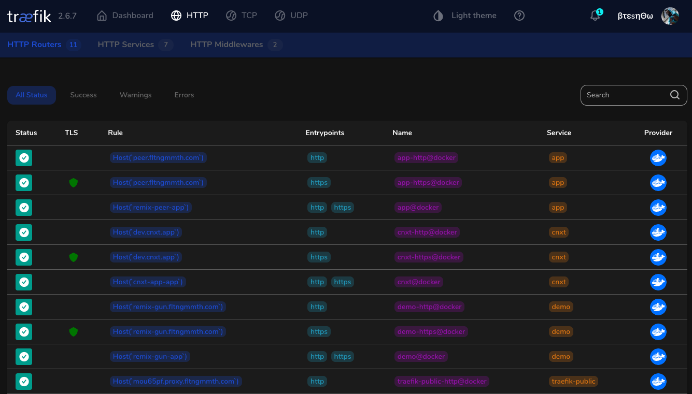

# Remix.Gun Boilerplate


This is a boilerplate for creating distributed web apps. Using GunDB, SEA authentication and React v18. Out of the box two or more boilerplate instances can share data via GUN's peer websocket feature.

## Under The Hood

- [x] Remix.GUN Relay Server Adapter
- [x] Authorization with Gun.Sea/ Gun User Api
- [x] Data Encrytion
- [x] Docker Swarm Production Deployment
- [x] Traefik Proxy & Load Balancing

## What's inside?

This repo uses [yarn](https://www.yarnpkg.com/) as a package manager. It includes the following packages/apps:

### Packages

- `packages/remix`: a [Remix](https://remix.run/) application that makes up the public facing UX
- `packages/chain-extensions`: Custom Gun hooks with types.
- `packages/server`: an ESM Node.js server that brings everything together for deployment
- `packages/ui`:
- `packages/temporal`:
- `packages/dev-scripts`:
- `config/eslint-config-custom`: shared eslint config that includes `@remix-run/eslint-config` and `prettier`
- `config/tsconfig`: base tsconfig that other packages inherit from

Each `package/*` is 100% [TypeScript](https://www.typescriptlang.org/).

### Utilities

This turborepo has some additional tools already setup for you:

- [TypeScript](https://www.typescriptlang.org/) for static type checking
- [ESLint](https://eslint.org/) for code linting
- [Prettier](https://prettier.io) for code formatting
- [Github Actions](https://github.com/features/actions)

## Traefik Reverse Proxy & Load Balancing In Docker Swarm

Self-hosted deployment is a breeze. There are [swarm stacks](swarm-stacks) for the app and Traefik. Middleware redirects to https and uses a Lets Encrypt tls certificate resolver. Authenticated UI dashboard is also available. There are github worklow dispatchers for traefik and the app so you can spin up a new production instance from the github repo. See [Self-Hosted Github Runners Documentation](https://docs.github.com/en/actions/hosting-your-own-runners/about-self-hosted-runners) .



## Setup

Clone and install dependencies:

```
yarn
```

### Build

To build all apps and packages, run the following command:

```
yarn build
```

### Develop

To develop all apps and packages, run the following command:

```
yarn dev
```

### Remote Caching

Turborepo can use a technique known as [Remote Caching (Beta)](https://turborepo.org/docs/core-concepts/remote-caching) to share cache artifacts across machines, enabling you to share build caches with your team and CI/CD pipelines.

By default, Turborepo will cache locally. To enable Remote Caching (Beta) you will need an account with Vercel. If you don't have an account you can [create one](https://vercel.com/signup), then enter the following commands:

```
npx turbo login
```

This will authenticate the Turborepo CLI with your [Vercel account](https://vercel.com/docs/concepts/personal-accounts/overview).

Next, you can link your Turborepo to your Remote Cache by running the following command from the root of your turborepo:

```
npx turbo link
```

## Useful Links

Learn more about the power of Turborepo:

- [Pipelines](https://turborepo.org/docs/core-concepts/pipelines)
- [Caching](https://turborepo.org/docs/core-concepts/caching)
- [Remote Caching (Beta)](https://turborepo.org/docs/core-concepts/remote-caching)
- [Scoped Tasks](https://turborepo.org/docs/core-concepts/scopes)
- [Configuration Options](https://turborepo.org/docs/reference/configuration)
- [CLI Usage](https://turborepo.org/docs/reference/command-line-reference)
